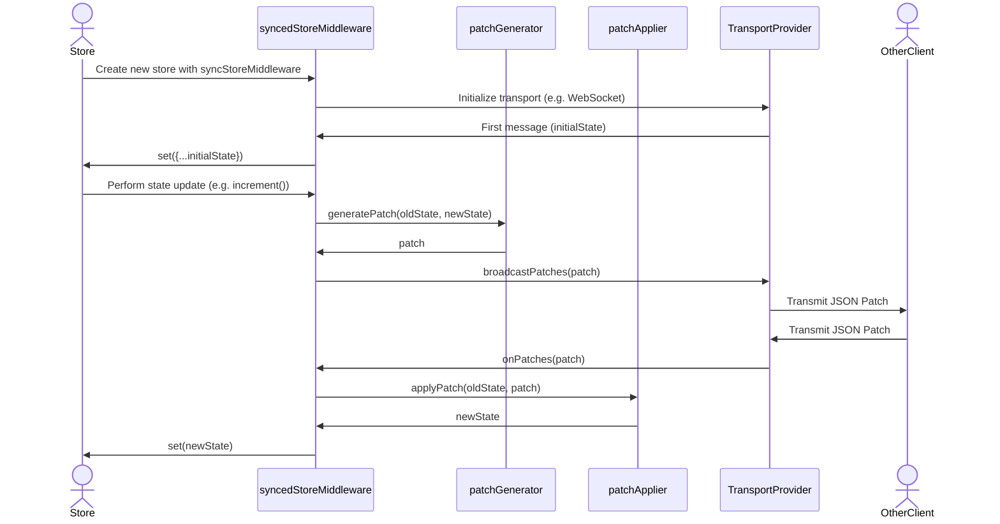

# zustand-sync


https://github.com/user-attachments/assets/bdb22ca8-0ecc-4185-9c25-f61cab7feb61

A barebones middleware to sync zustand stores across multiple clients.
`zustand-sync` uses JSON Patch (RFC 6902) under the hood to translate state changes into patches that can be sent over a transport layer.

## Basic Usage

In your react project with zustand installed:


```
npm install @ryanntannn/zustand-sync
```

```
docker run -p 8080:8080 ryanntannn/zustand-sync-server:latest
```

Then, add `syncStoreMiddleware` to your zustand with the `WebSocketTransportProvider`:

```typescript
import { create } from "zustand";
import { syncStoreMiddleware, WebSocketTransportProvider } from "zustand-sync";

type ExampleStore = {
  count: number;
  increment: () => void;
  decrement: () => void;
  reset: () => void;
};

export const useExampleStore = create(
  syncStoreMiddleware(
    (set) => ({
      count: 0,
      increment: () => set((state) => ({ count: state.count + 1 })),
      decrement: () => set((state) => ({ count: state.count - 1 })),
      reset: () => set({ count: 0 }),
    }),
    {
      transport: WebSocketTransportProvider<ExampleStore>({
        projectId: "your-project-id",
      }),
    }
  )
);
```

## Roadmap

- [x] Basic WebSocket transport provider
- [x] WebSocket server with project-based routing
- [ ] Storage providers on server (Redis, Postgres, In-memory/Disk etc.)
- [ ] Additional transport providers (WebRTC, HTTP Long Polling etc.)
- [ ] Authentication and Authorization
- [ ] Conflict resolution, disaster recovery and offline support

## How It Works

This sequence diagram illustrates the ideal flow of how `zustand-sync` works with a WebSocket transport provider:


